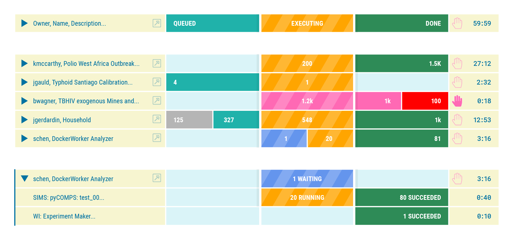

###### This is pre-release software. Please **[log issues](/issues)** found.
# Dashboard
A Means for Visualizing Progress of Work Processing on High Performance Computing (HPC) Cluster as Implemented by the Institute for Disease Modeling's **Computational Modeling Platform Service** (COMPS)

This JavaScript module, [queue-chart.js](/queue-chart.js), should allow a web client to facilitate access to data available from the [COMPS API](https://comps.idmod.org/api/metadata) via conventional Representational State Transfer (REST) protocol, also known as [RESTful web services](https://en.wikipedia.org/wiki/Representational_state_transfer).

This is the same code intended for the COMPS Web Client. Included within this code is required interface (HTML) and styles (CSS). A simple demonstration is provided (see [the demo](/tree/master/demo)). An illustration of a possible design: 

***

***

### Installation
While it is possible to simply clone or download this repository and drag the code into a project, it is recommended to use a package manager to maintain version control and facilitate keeping dependent projects current with the latest changes. This is critical software that should be expected to change, and the most-current version is the only version guaranteed to work with the COMPS system.

[NodeJS](https://nodejs.org/en/download/) is a technology which can execute scripts on a computer. In this application, NodeJS fasciliates the Webpack framework in assembling the various ingredients of the Client code, preparing them for deployment from a server to a browser. It is recommended to install NodeJS to add this code to another project or run the enclosed demonstration.

The Node Package Manager ([NPM](https://www.npmjs.com/get-npm)) is installed as a component of NodeJS and is a popular means for executing the `package.json` of a project.
